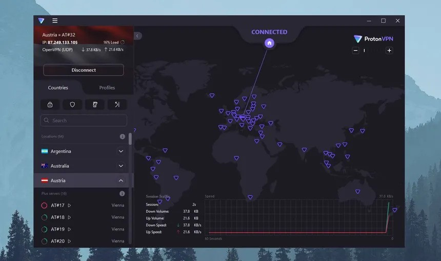

# Elevate-Labs-task-8

# Task 8: Working and Understanding VPN

## Objective  
Understand the role of VPNs in protecting privacy and enabling secure communication.

## Tools Used  
- **VPN Client:** ProtonVPN (Free Tier)  
- **IP Checker:** [whatismyipaddress.com](https://whatismyipaddress.com)  
- **Browser:** Brave (used for IP check and test browsing)

## VPN Setup Steps

1. **Sign-Up:**  
   - Created a free account at [https://protonvpn.com](https://protonvpn.com).  
   - Email verification completed.

2. **Download & Install:**  
   - Downloaded ProtonVPN client for Linux (.deb package for Kali).  
   - Installed using:  
     ```bash
     sudo dpkg -i protonvpn-stable-release_1.0.3-1_all.deb
     sudo apt install protonvpn
     ```

3. **Login:**  
   - Logged into the ProtonVPN Linux app via terminal:  
     ```bash
     protonvpn-cli login <username>
     ```

4. **Connect to Server:**  
   - Connected to the nearest free server:  
     ```bash
     protonvpn-cli connect --fastest
     ```  
   - Successfully established connection.

5. **IP Verification:**  
   - Visited [whatismyipaddress.com](https://whatismyipaddress.com).  
   - IP address changed to a different country (verified).

6. **Encryption Confirmation:**  
   - Browsed multiple HTTPS websites; traffic appeared encrypted.  
   - DNS leak test confirmed no DNS leaks.

7. **Disconnect & Compare:**  
   - Disconnected using:  
     ```bash
     protonvpn-cli disconnect
     ```  
   - IP reverted to original.  
   - Slight increase in browsing speed after disconnecting.

## Screenshot of Connection Status  


## VPN Benefits  
- **Privacy Protection:** Hides your real IP address and location.  
- **Encryption:** All data traffic is encrypted (e.g., AES-256 encryption in ProtonVPN).  
- **Bypass Censorship:** Access content unavailable in your region.  
- **Secure Public Wi-Fi:** Safe browsing on untrusted networks.

## VPN Limitations  
- **Slower Speed:** Due to encryption overhead and server distance.  
- **Free Plans Are Limited:** Fewer server choices, sometimes slower speeds.  
- **Not 100% Anonymous:** VPN providers can still log data unless strictly no-log.  
- **May Trigger CAPTCHAs:** Frequent IP switches cause security checks.

## Conclusion  
Using a VPN significantly enhances online privacy and protects data from interception.  
While free VPNs like ProtonVPN are good for basic use, premium options offer better speed, reliability, and privacy guarantees.
